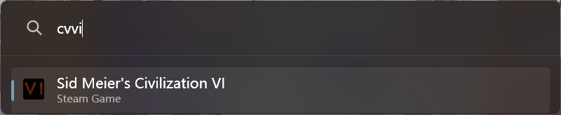

# PowerToysRun Steam Launcher
Launch any game installed by steam, without creating any desktop shortcut.

## Screenshot

## Installation
1. Download plugin from Release
2. Extract it to `%LOCALAPPDATA%\Microsoft\PowerToys\PowerToys Run\Plugins`
