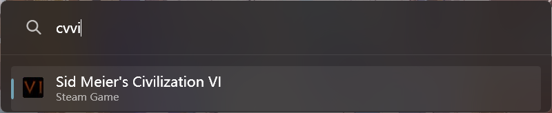

# PowerToysRun Steam Launcher
Launch any game installed by steam, without creating any desktop shortcut.

## Screenshot


## Installation
#### Manual
1. Download plugin from Release
2. Extract it to `%LOCALAPPDATA%\Microsoft\PowerToys\PowerToys Run\Plugins`
#### Via [ptr](https://github.com/8LWXpg/ptr)
```
ptr add SteamLauncher KawaiiZapic/PowerToysSteamLauncher
```

## Usage
1. The default keyword is `==`
2. Once plugin is loaded, it will scan all Steam Library to find installed games.
3. If a new game installed / a game uninstalled, plugin will auto update cached game list.

## Hide a Game From Global Result
This function **only work** when you allow plugin show result in global search result in PowerToys Run Setting.  

1. Search the game you want to hide and click the `Hide Game in Global Result` button in the right side of search result.
2. Once you want to restore the game, search the game prefix with action keyword (default is `==`), and click the `Unhide Game` button.

## TODO
1. [x] Automatic update game list
